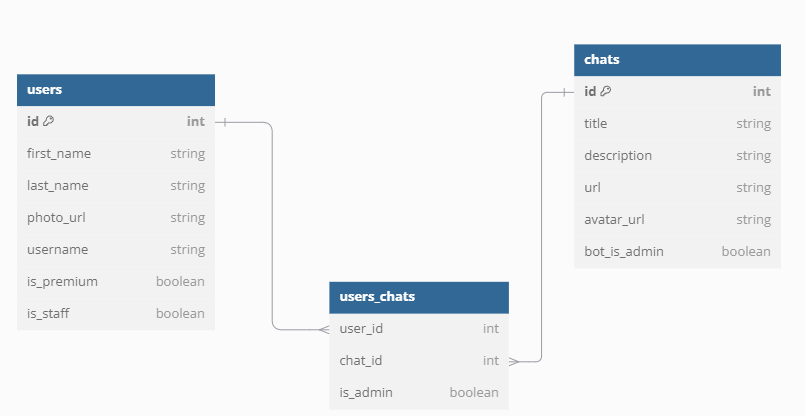

# Телеграм бот удаления сотрудников и Web-интерфейс для управления чат-ботом

## Бейджи статус бота CI/CD
[](https://github.com/fv_hr/group_guard-bot-web/actions/workflows/bot.yml/badge.svg)

## Бейджи статус бэкенда CI/CD
[](https://github.com/fv_hr/group_guard-bot-web/actions/workflows/backend.yml/badge.svg)

## Languages


## ER диаграмма БД


## Что умеет наш бот?
### Основные возможности: 
1. Отслеживание изменения фото группы.
2. Отслеживание изменения названия группы.
3.  Отслеживание добавление/удаления админов чата.
4. Отслеживание заходящих/уходящих пользователей.
5. Отслеживание назначение бота администратором/разжалование бота.
6. Изменение фото/описания/названия группы.
7. Удаление пользователей с группы/со всех групп, где вы являетесь администратором.
8. WebAPP сервис управления всеми чатами и участниками, где есть бот.

## Клонирование репозитория
`git clone https://github.com/fvhr/group_guard-bot-web`

## Создайте файл `.\bot\.env`
```
BOT_TOKEN=токен вашего бота
ADMIN_TG_UUID=tg id пользователя кому отправлять уведомление о запуске бота
BASE_AVATAR_PATH=базовый путь до автарки если её по каким то причинам не получилось взять
BASE_API_TG_URL=https://api.telegram.org/file/bot
BASE_API_BACKEND_URL=url api backend
WEB_APP_URL=url на webapp
```

## Создайте файл `.\backend\.env`
```
ALLOWED_HOSTS=127.0.0.1,0.0.0.0,localhost
SECRET_KEY=секретный ключ django

POSTGRES_DB=название базы данных
POSTGRES_USER=пользователь, который будет подключаться к базе
POSTGRES_PASSWORD=пароль от базы данных
```

## Запуск
`docker-compose up --build -d`  
Сайт будет запущен на localhost

## Посмотреть логи
`docker-compose logs`